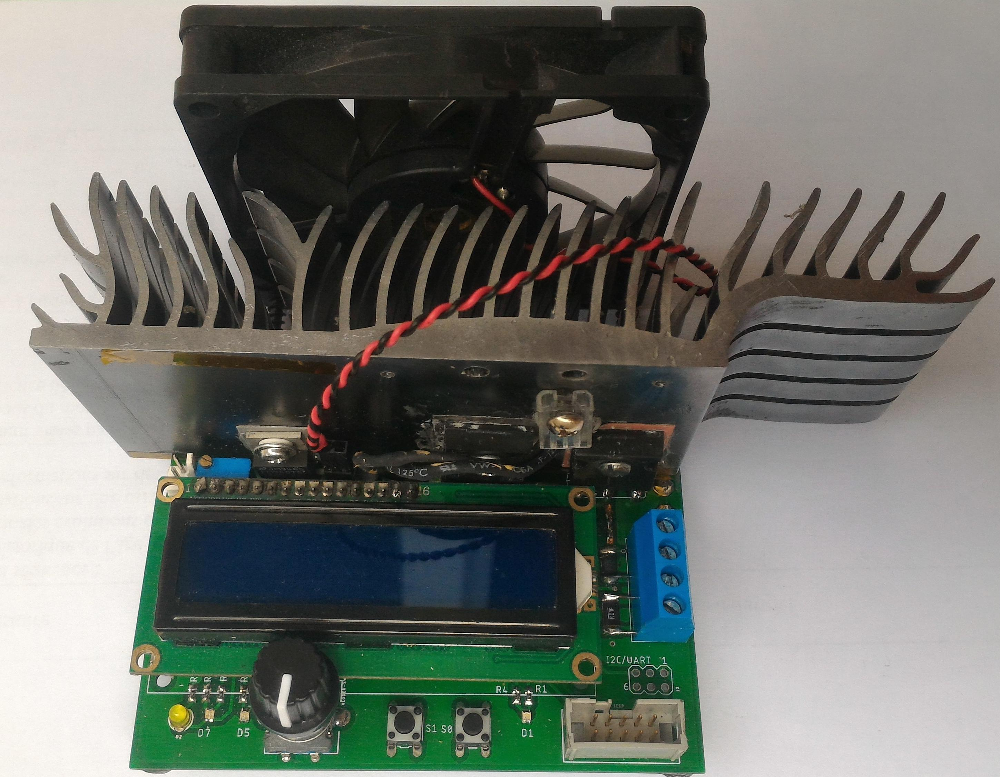
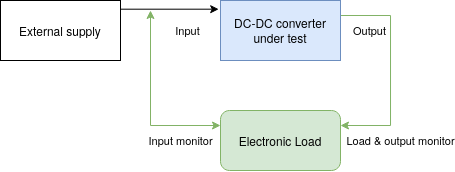
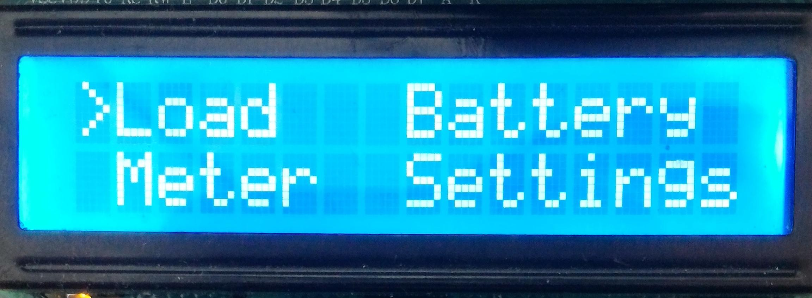
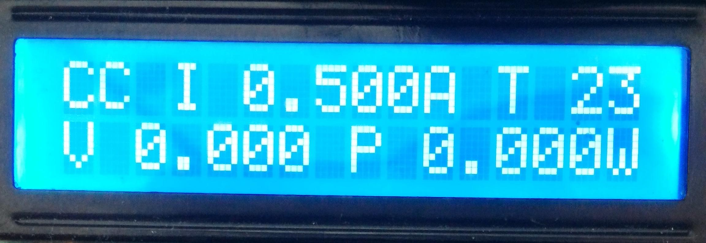
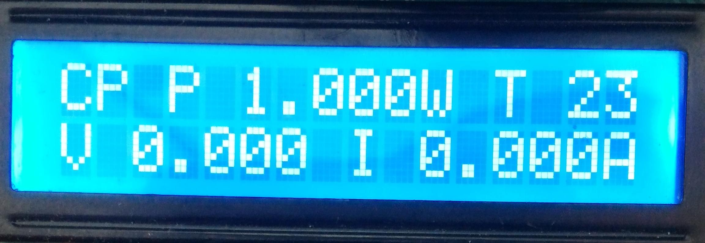
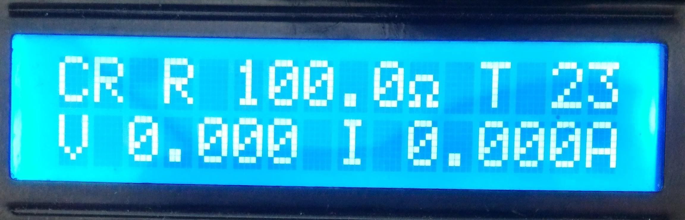
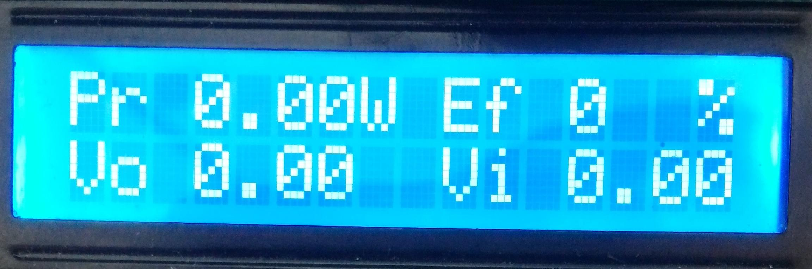
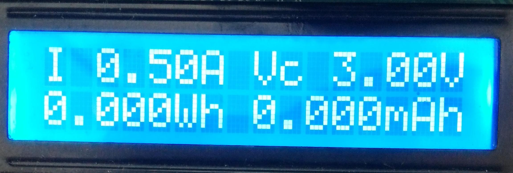
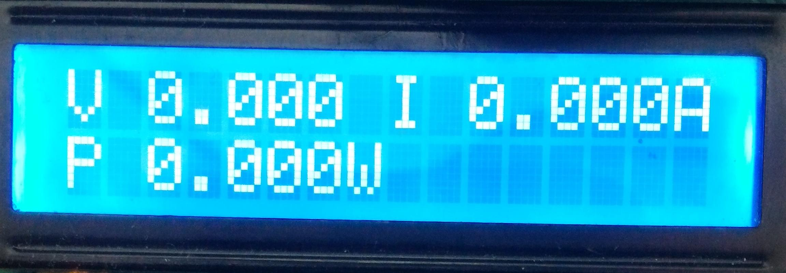
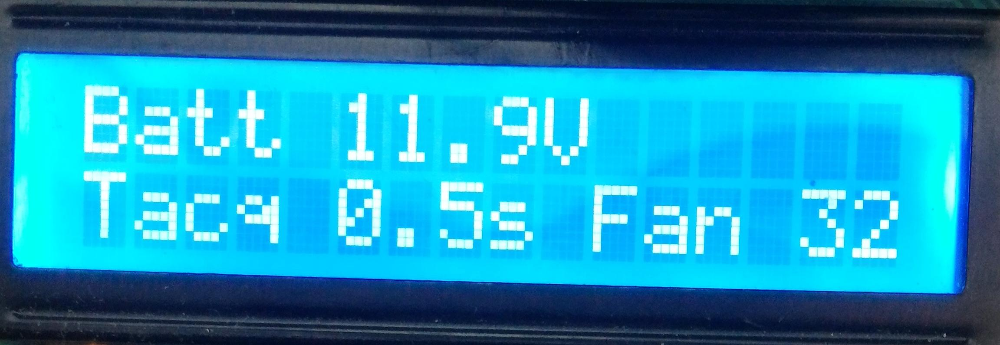

# Electronic Load



This repository hosts my work in developping a custom electronic load from scratch. 
For more information on what an electronic load does and what it can be used for, see [this](https://www.mouser.com/pdfdocs/DC_Electronic_Load_Application_Note.pdf). 

Specifically, this load targets DC-DC converters testing, as it includes input and output power monitoring.



I you have any question on this repository, feel free to contact the owner at (reivax[dot]boucoi[at]laposte[dot]net).

Featured on [Hackaday](https://hackaday.com/2020/06/06/a-diy-electronic-load-with-a-twist/) and [Electronics-Lab](https://www.electronics-lab.com/diy-electronic-load-dc-dc-converter-characterization/)!

---
---

### Features

* Constant Current, Power and Resistance modes
* Battery capacity logging with adjustable cutoff voltage
* Input and output power logging : instant efficiency reading for DC-DC converters
* Rotary encoder driven interface
* Dedicated Load ON/OFF button
* Intuitive LCD menu system with editable values
* 12bit current, voltage and power measurements 
* 30W continuous sinking capability, 250W peak
* Temperature controlled fan with auto shutdown.
* Adjustable acquistion rate
* 115200 bauds serial communication through USB with a PC (non-isolated !)

### Specifications
> Enough talk, give us the specs, son !

Altough the device has not been fully qualified through systematic testing, here are the basic specs you can expect. 
* Input voltage range : 0 - 100V DC maximum, 2-80V DC regulating
* Supply voltage range : 0 - 16V maximum, 12V nominal 
* Device current consumption : 50mA nominal (0.6W)
* Load current range : 5mA - 5.25A, in 8mA steps
* Current regulation : 5% +/- 8mA typical @ 8kHz bandwidth
* Transient response : rise time < 20µs/A, overshoot < 2%
* Constant Power/Resistance regulation bandwidth : 10Hz

---
---

## Schematic and Layout
The heart of the system is an Atmel ATmega328P AVR microcontroller with 32kB of Flash and 2k of RAM running at a whopping 16MHz. It interfaces an I2C 12bit DAC (the MCP47FEB21A1) and the LTC2992 dual power monitor chip.

The USB serial interface uses the MCP2221A bridge. The display is a classic 16x2 LCD.

On the analog part, 10mΩ  and 0.2Ω shunt resistors are used, coupled with two W9NK90Z N-ch power MOSFETS. The heatsink was salvaged from an old graphics card. Attached are a 10k NTC and a generic fan (12v @ 200mA, 80mm). Current regulation is achieved through the help of a MCP6H02 opamp, and a carefully designed feedback network which guarantees the specified rise time with little to no overshoot.


The layout was done using the Eagle software (v9.5.2). Gerbers, Eagle project files, top and bottom views are available on the `pcb` folder. PCBs were printed using JLCPCB service.
The schematic is available in a pdf and Eagle `.sch` format as well. A Bill of Materials (BOM) is also available, in plain text and html format, on the `pcb` folder.

Several user-definable bi-color status LEDs are included, such as Load ON/OFF, TX & RX, acquisition blink, as well as a power LED.

An expansion/debug port is provided, with +5V, ground, I2C and UART available.

There are several issues regarding the layout of the PCB, as it is a first version. Improper Kelvin connections to the current sense resistors, or wrong hole size for the power input connector by example. The heatsink originally used is salvaged from old equipement and the footprint may not be relevant to anyone else. Space for rubber feet placement should be included. Also, the LCD is too close to the heatsink, which is impractical during assembly (especially accessing the fan and temp sensor connector).


---
---

## Firmware
The firmware for this device is currently in revision 1.3. It is written for a barebone ATmega328p Atmel microcontroller.

```20014 bytes (65%) of program storage space. Maximum is 30720 bytes.```

```1586 bytes (77%) of dynamic memory, 462 bytes left. Maximum is 2048 bytes.```

As you can see it's not the lightest firmware, mostly due to the use of the `Wire` and `LCD` librairies from Arduino, which are bulky. However, there is still enough room for future improvements. Just keep in mind if you want to improve the project to leave space for local variables allocation.

---

### Programming
An ISP port is provided on the board, making reflashing easy. All you need is an AVR-compatible programmer with the standard 10 pins ICSP header. I used the very good (and very cheap!) [Usbasp](https://www.fischl.de/usbasp/) during developpement. Avrdude can be used to download the pre-compiled binary `main.hex`, or you can compile the project yourself first.
`Avr Fuses settings :(E:FD, H:DE, L:FF)`

To program the chip, execute : `avrdude -p m328p -c usbasp -P usb -U flash:w:firmware/main.hex`

---

### Software structure

* Display related stuff : `Screen.cpp`, `Menu.cpp`
* LTC2992 power monitoring stuff : `PM.cpp`
* DC Load stuff : `Load.cpp`
* Generic io interfacing : `Utils.cpp`, `SimpleRotary.cpp`, `Wire.cpp`, `LCD.cpp`
* Serial command parsing : `SerialCommand.cpp`
* Serial interface : `Interface.cpp`
* Control loop and display update : `main.cpp`

---

### Usage
First apply power to the device through USB (for limited load capacity) or, better, 12V DC on the input power jack (beware of polarity).

The welcome screen pops up with the following menus : 



* Load allows you to set the load parameters and mode (CC/CP/CR)
* Battery enters the battery capacity mode
* Meter measures input power
* Settings is self explanatory

Turn the rotary encoder to cycle through the menus and screens, and push to enter. At any time use the back button (to the right of the encoder) to get back to the previous menu or exit editing mode. 

Editing a value starts by selecting the value to edit. Press enter on a screen, you should get a flashing square in front of a value. Turn the knob until the desired value is selected. Press enter to edit. The leftmost digit is selected. To change the edited digit, press enter once again. Press back to validate. 

**You will have to restart the load in order for the changes to take effect.** This is done to prevent happy little accidents. To start and stop the load, press the rightmost button. The rightmost blue LED should light up. If the LED turns red, a fault occured. Faults can happen if :
* The heatsink temperature exceeds the hard temperature stop defined in `Load.h`
* The load fails to regulate. This will mostly be caused by the DUT hiccuping (or sharp V/I curve), or insufficent power to the Electronic Load.


The load menu has 4 screens : 



The last screen shows the power lost in the DUT (Pr), the efficency, the input and output voltages of the converter.

The load mode (CC/CP/CR) is determined by the screen displayed when the load is started. If the screen is not one of the CC/CP/CR screens, is starts in the previously used mode.

Here is what the Battery screen looks like :



Set the discharge current I and the cutoff voltage Vc before starting the load with the rightmost button. Accumulated capacity in Wh and Ah are displayed. The load will automatically shut off when the input voltage is below the cutoff voltage. The total capacity will remain displayed until the load is restarted in this mode.

The meter screen shows the input measurements :



The settings screen alows to modify various parameters : 



It monitors the supply voltage and you can change the threshold temperature for the fan, as well as the refresh rate of the screen. Note that the load has a hard temperature stop defined in `Load.h`, and a maximum refresh rate of approx 10Hz.
 

---
---

## Improvements

- [x] Design a mechanical mount for the fan / stabilize the board
- [x] Re-think the menu system to be more modular / lower size
- [x] Add logging capability with serial interface (could be improved)
- [x] Add current sweep programming for DC-DC converters automatic characterization (with di/dv auto resolution) (could be improved)
* Fix the minimum current issue (currently min is 5mA)
* Fix the 4 terminal Kelvin connection on the 10mΩ current sense resistors in the PCB layout
* Design a usb isolator companion board or add SD card logging addon on i2c bus.
* Design 4.5V->12V boost addon to allow full operation from usb power
* Better code commenting
* Save last used confguration on EEPROM for next power-up.
* ...
